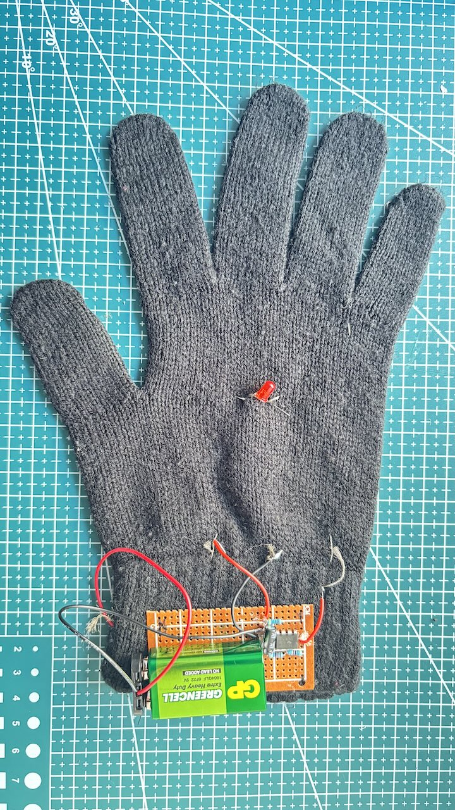

## What you will make

Create flashing bike gloves and stay safe when riding in the dark!

--- print-only ---

{:width="270px"}

--- /print-only ---

--- no-print ---

<video width="270" height="480" controls autoplay>
<source src="images/bike_glove.mp4" type="video/mp4">
</video>

--- /no-print ---

### You will need:
- Breadboard
- 2 LEDs
- 2 555 timers
- 4 47kΩ resistors
- 2 470Ω or 330Ω resistors
- 2 10µF capacitors
- Jumper wires
- 9V battery
- PP3 connector (battery snap)
- Prototype circuit board
- Conductive thread
- Needle
- A pair of gloves
- Soldering kit

**Optional**:
- Potentiometer
- Light-dependent resistor (LDR)
- Extra 47kΩ resistors
