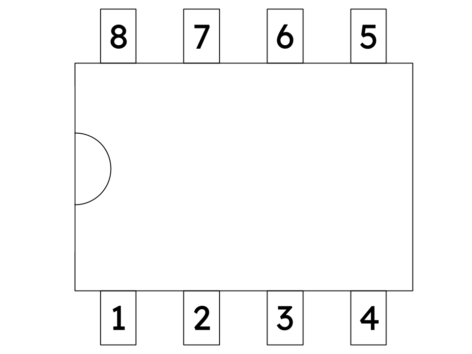

## Make a prototype

### Power the 555 timer

With the notch on the left, the 555 timer pins are:

1: Ground
2: Trigger
3: Output
4: Reset
5: Control
6: Threshold
7: Discharge
8: VCC

{:width="450px"}

--- task ---

Put the 555 timer in the middle of the breadboard, across the centre gap.

{:width="450px"}

--- /task ---

--- task ---

Connect the 555 timer power pins.

Connect **pin 1** to the ground rail.

{:width="450px"}

Connect **pin 8** to the positive rail.

{:width="450px"}

Connect **pin 4 (reset)** to the positive rail (so it is always enabled).

{:width="450px"}

You will add the battery to the breadboard at the end.

--- /task ---

### Build the timing network

--- task ---

Join **pins 2** and **6** (**trigger** and **threshold**) together.

{:width="450px"}

--- /task ---

--- task ---

Add two 47kΩ resistors.

The first should connect the positive rail to **pin 7**.

{:width="450px"}

The second should connect **pin 7** to **pins 2** and **6** (the joined pins).

{:width="450px"}

--- /task ---

--- task ---

Add the capacitor (10µF).

Connect the positive (long) leg to the joined **pins 2** and **6**.

Connect the negative (short) leg to the ground rail.

{:width="450px"}

--- /task ---

### Add the LED and resistor

--- task ---

Connect one side of the 470Ω resistor to **pin 3 (output)**, and connect the other side of the resistor to the long leg of the LED.

Connect the short leg of the LED to the ground rail.

{:width="450px"}

--- /task ---

--- task ---

**Test:**

Add the 9V battery and connect the power and ground rails.

Connect the positive terminal of the battery to the red positive rail.

Connect the negative terminal of the battery to the blue ground rail.

{:width="450px"}

The LED should blink once every second — great for making you more visible to other road users!

--- no-print ---

<video width="480" height="270" controls>
<source src="images/LED_555.mp4" type="video/mp4">
</video>

--- /no-print ---

**Debug:** Unplug the battery and check that:

- **Pin 1** is connected to the ground rail, **pin 8** is connected to the positive rail, and **pin 4** is connected to the positive rail
- **Pins 2** and **6** are joined correctly
- The capacitor legs are the correct way around
- The LED legs are the correct way around

--- /task ---