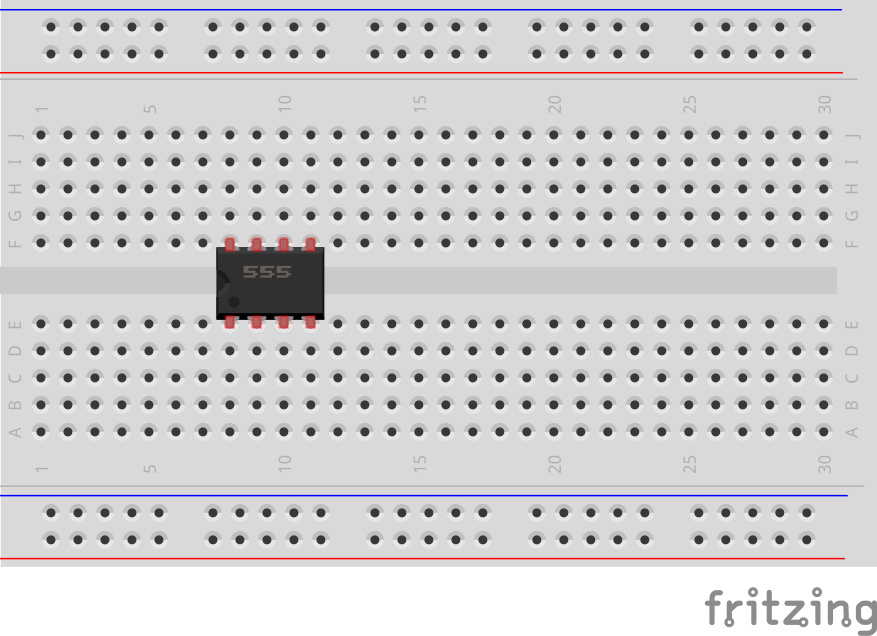
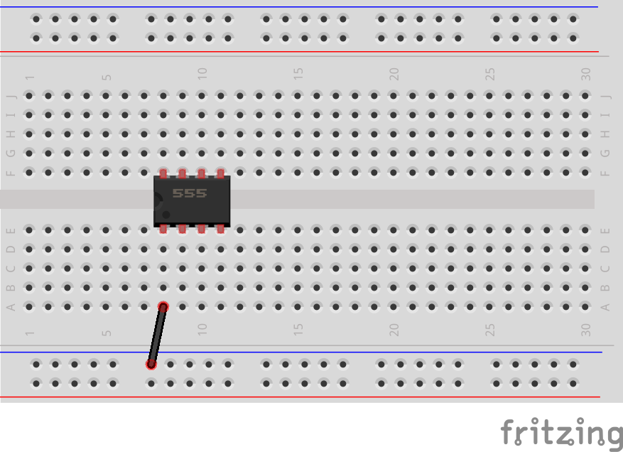
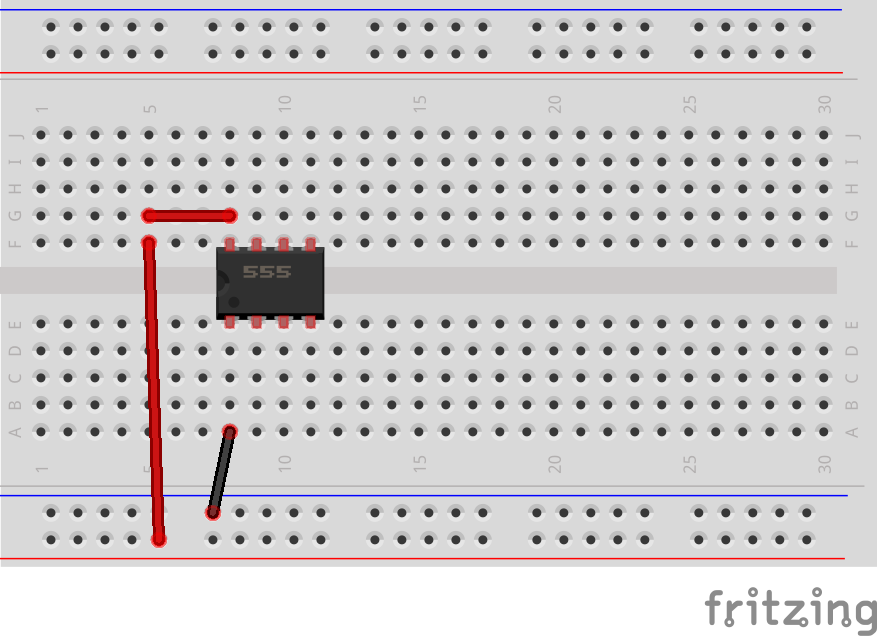
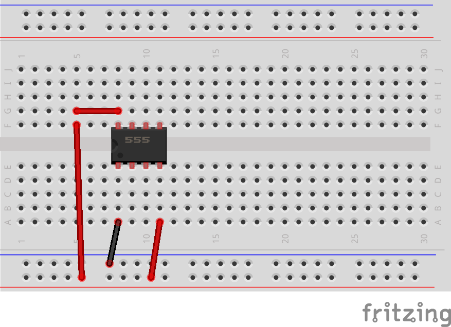
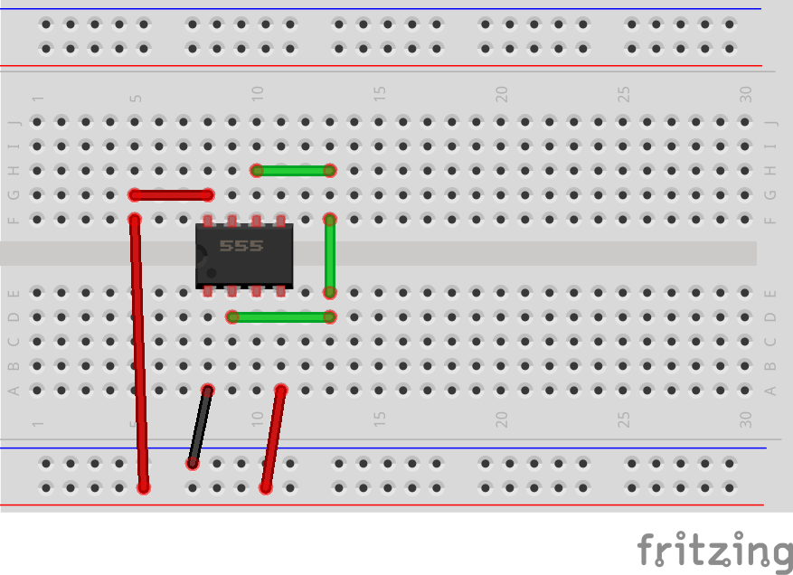
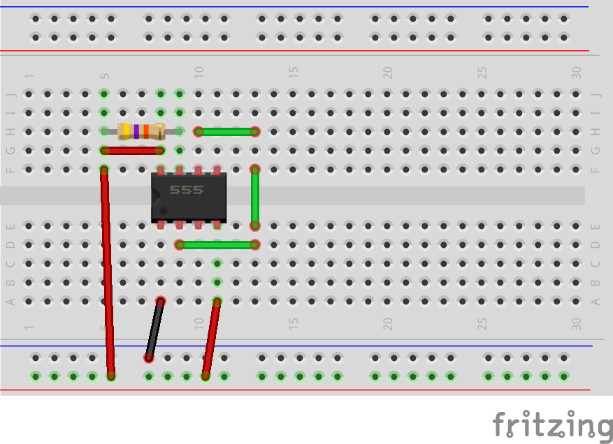
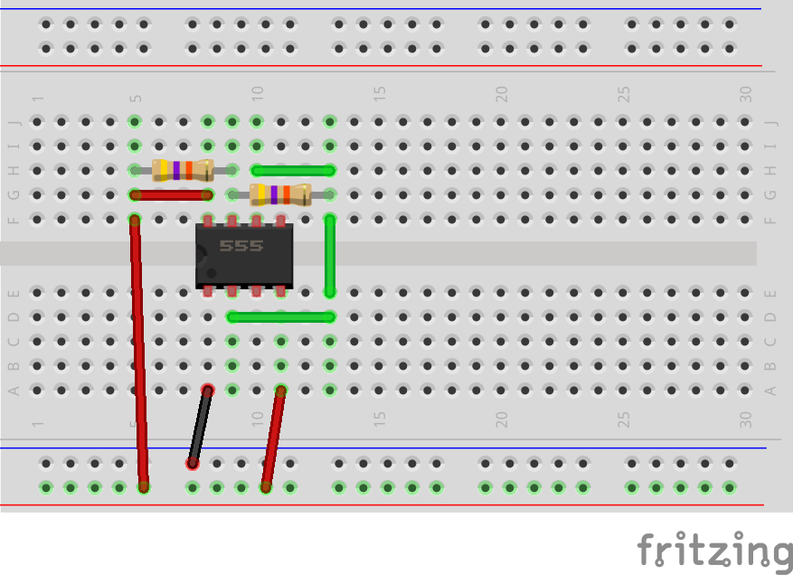
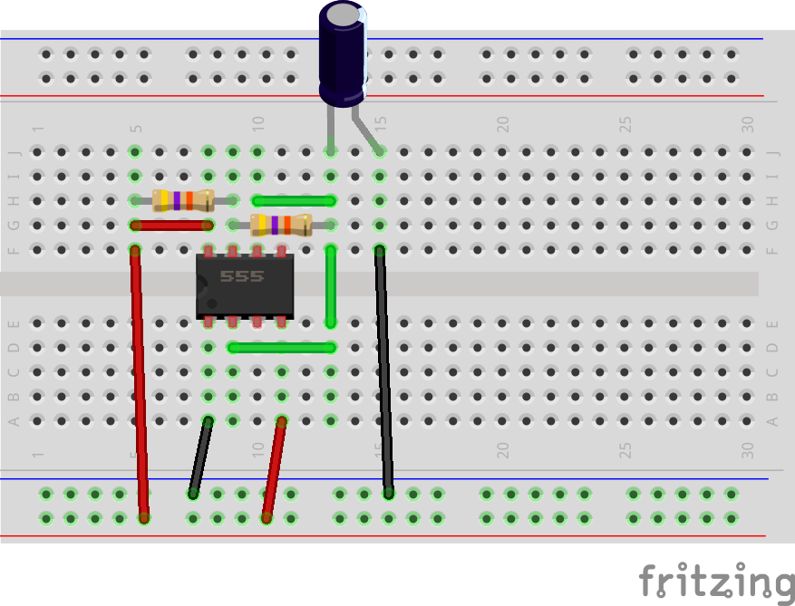
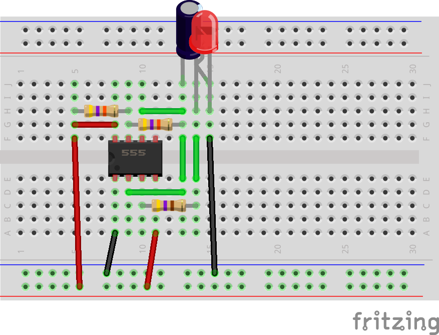
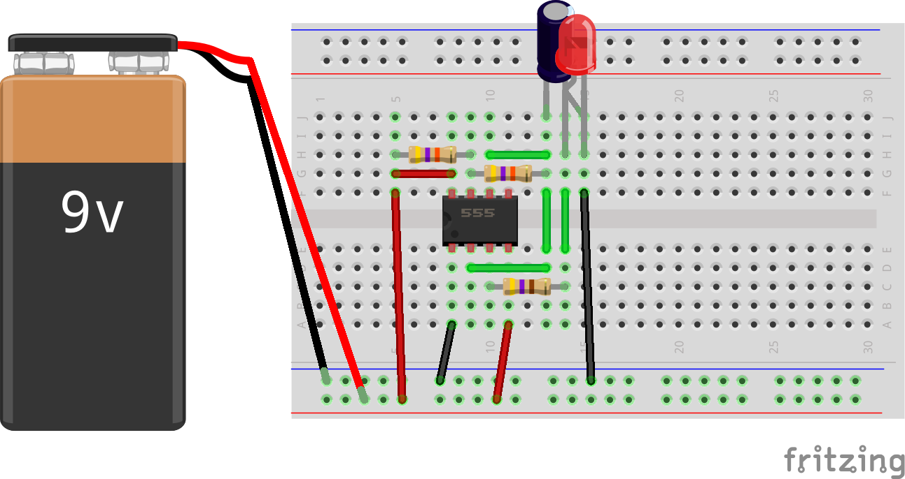

## Prototype

### Power + 555 “skeleton”

--- task ---

Put the 555 chip in the middle of the breadboard, across the centre gap.

With the notch on the left, the pins are:

```
8  7  6  5
|--|--|--|

|--|--|--|
1  2  3  4
```

{:width="450px"}

--- /task ---

--- task ---

Connect the 555 power pins:

Pin 1 → ground rail

{:width="450px"}

Pin 8 → positive rail

{:width="450px"}

Pin 4 (RESET) → positive rail (so it is always enabled)

{:width="450px"}


At this stage, the 555 chip has power pins wired but nothing else.

--- /task ---

### Build the timing network

--- task ---

Join pins 2 and 6 together (TRIG and THRESH).

{:width="450px"}

--- /task ---

--- task ---

Add two 47 kΩ. resistors:

- The first connects the positive rail to pin 7.

{:width="450px"}

- The second connects pin 7 to pins 2 and 6 (the joined pins).

{:width="450px"}

--- /task ---

--- task ---

Add the capacitor (10 µF) so that:

- The positive (long) leg connects to joined pins 2 and 6

- The negative (short) leg connects to the GND rail

{:width="450px"}

The 555 will oscillate, but you will no notice this until it is connected to an LED.

--- /task ---

### Add the LED and resistor

--- task ---

Connect Pin 3 (output) to the 470Ω resistor, which connects to the LED's long leg.

Connect the LED's short leg to the ground rail.

{:width="450px"}

--- /task ---

--- task ---

Add the 9V battery and connect the power and ground rails:

- Battery positive to the red positive rail

- Battery negative to the blue ground rail

{:width="450px"}

--- /task ---

--- no-print ---

<video width="480" height="270" controls>
<source src="images/LED_555.mp4" type="video/mp4">
</video>

--- /no-print ---

The LED should blink once every second.

**Debug**: Unplug the battery and recheck:

- Pin 1 = GND, pin 8 = +9V, pin 4 tied to +9V
- Pins 2 & 6 properly joined
- Timing capacitor legs the correct way round
- LED legs the correct way round.