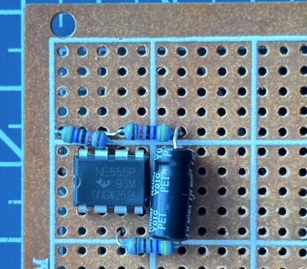
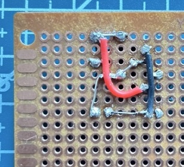
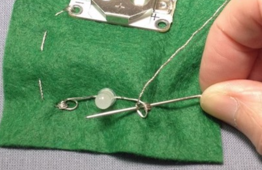
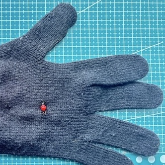
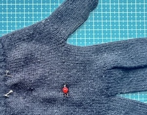
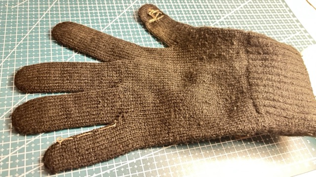
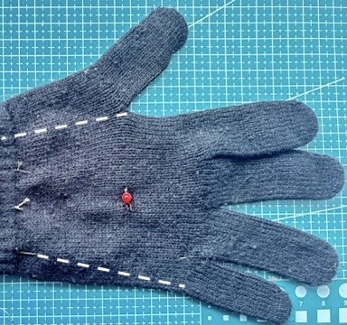
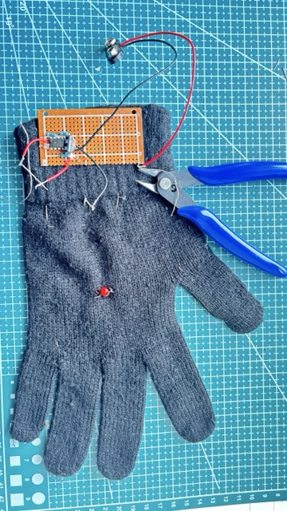
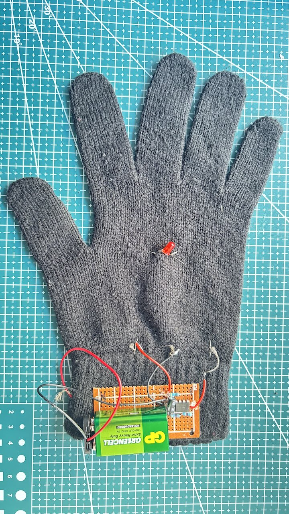

## Add to your gloves

If you are new to soldering, check out our [Getting started with soldering](https://projects.raspberrypi.org/en/projects/getting-started-with-soldering){:target="_blank"} guide for support.

### Add the components

--- task ---

Using the breadboard as a guide, add the components to a prototype circuit board (PCB).

--- /task ---

### Solder the components

--- task ---

Solder the components to the PCB. You can use resistor legs as positive and negative rails if your PCB does not have them.

--- /task ---

### Add the LED

--- task ---

Curl the LED legs into loops and sew them into your glove with conductive thread.

{:width="450px"}

Make sure there are no sharp edges near your hand. You can trim the legs with snippers.

--- /task ---

--- task ---

Sew the thread from each leg through the back of the glove to the cuff.

{:width="450px"}

{:width="450px"}

--- /task ---

### Create a switch

--- task ---

Sew conductive thread into the thumb and the little finger of the glove. The pads of thread should touch when you bring them together.

{:width="450px"}

--- /task ---

--- task ---

Sew the thread from each side of the switch along the back of the glove to the cuff.

{:width="450px"}

--- /task ---

### Connect the switch

--- task ---

Connect the negative terminal of the 9V battery to the negative rail of your PCB.

Connect the positive terminal of the 9V battery to the conductive thread from the thumb.

Connect the positive rail of the PCB to the conductive thread from the little finger.

{:width="450px"}

--- /task ---

### Cut the PCB

--- task ---

Cut the PCB in a straight line, leaving space for the 9V battery.

{:width="450px"}

This will make it fit on your wrist better when you ride your bike.

--- /task ---

### Connect the LED

--- task ---

Connect the conductive thread from the LED's long leg to the 470Ω resistor.

Connect the conductive thread from the LED's short leg to the PCB's negative rail.

{:width="450px"}

--- /task ---

--- task ---

Sew the PCB to the glove and secure the 9V battery to it (we used hot glue).

--- /task ---

--- no-print ---

<video width="270" height="480" controls>
<source src="images/bike_glove_circuit.mp4" type="video/mp4">
</video>

--- /no-print ---