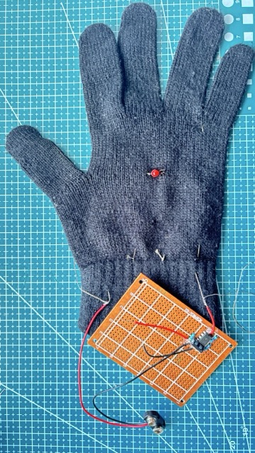

## Add to your gloves

If you are new to soldering, you could follow our [Getting started with soldering](https://projects.raspberrypi.org/en/projects/getting-started-with-soldering){:target="_blank"} project!

### Add the components

--- task ---

Using the breadboard as a guide, add the components to a prototype circuit board.

--- /task ---

### Solder the components

--- task ---

You can use resistor legs as positive / negative rails if your prototype board does not have them.

--- /task ---

### Add the LED

--- task ---

Curl the LED legs into loops and sew them directly into your glove with conductive thread.

{:width="450px"}

Keep the sharp edges are away from your hand. You can trim the legs with snippers.

{:width="450px"}

--- /task ---

--- task ---

Sew the thread from each leg through the back of the hand to the cuff.

{:width="450px"}

--- /task ---

### Create a switch

--- task ---

Sew conductive thread into the thumb and the little finger. They should touch when you bring them together.

{:width="450px"}

--- /task ---

--- task ---

Run the thread along the back of the hand to the cuff of the glove.

{:width="450px"}

--- /task ---

### Connect the switch

--- task ---

- The negative terminal of the 9V battery connects to the negative rail of your circuit.

- The positive terminal of the 9V battery connects to the conductive thread from the thumb.

- The positive rail of the circuit connects to the conductive thread from the little finger.

{:width="450px"}

--- /task ---

### Cut the PCB

--- task ---

Cut the PCB in a straight line, leaving space for the 9V battery.

{:width="450px"}

This will fit on your wrist better when riding your bike.

--- /task ---

### Connect the LED

--- task ---

- Connect the thread from the LED's long leg to the 470 Ω resistor

- Connect the thread from the LED's short leg to the circuit's negative rail

{:width="450px"}

--- /task ---

--- task ---

Sew the prototype board to the glove and secure the 9V battery to it (we used hot glue).

--- /task ---

--- no-print ---

<video width="270" height="480" controls>
<source src="images/bike_glove_circuit.mp4" type="video/mp4">
</video>

--- /no-print ---